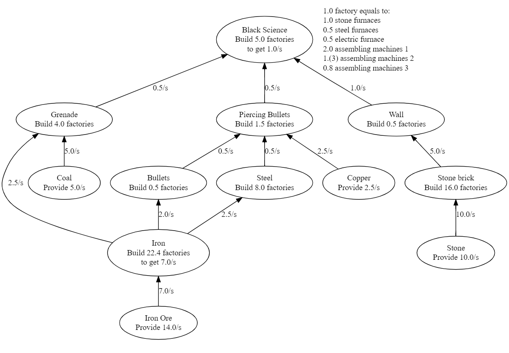
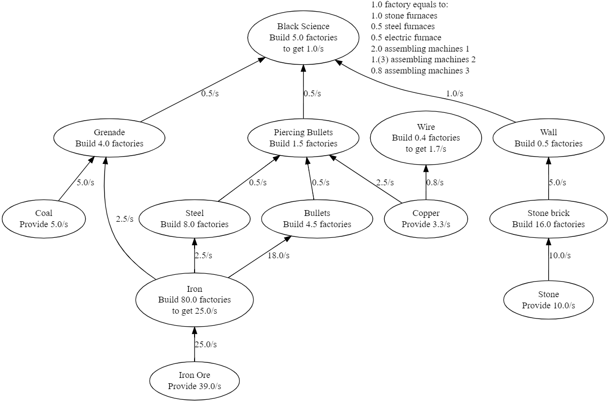

# Factorio DemandGraph

## Similarities to Python Factorio Calculator

This is "kind of" a fork of the [Python Factorio Calculator][orig-repo]
by user [Omnifarious][orig-author-github].

"Kind of" because:

* I found the original calculator very cool, but I missed some features.

* Initially I wanted to extend the original calculator, but while trying to add
  features, I have found myself in need to rewrite majority of the internals
  (primarilly to understand them better).

* Once I realized that my change is just too big, I have also removed most of
  the original functionalities and replaced them with the graph-generating
  feature.

This program still uses exactly the same XML file format which the original
Calculator does. Also, similarly to the Calculator, it isn't able to handle Oil
dependencies well (the file assumes that each factory produces exactly one type
of output).

## How to use it

You describe your **demands** - how many of which items per second you need.
The program generates a [DOT file][dot-lang] with all ingredients you need,
along with their own demand on ingredients, etc.

### Example 1

Let's say that you want to set up your factories to give you one Black Science
per second (that's how Military Science is called in the XML file).

Running:

```
python3 runner.py "1 Black Science"
```

gives you this graph:



Note, that the names in the XML file don't always match the names in the
game. And some of the item types are considered "raw" even if they're not (e.g.
"Copper" means "Copper Plate", and is considered "raw", and there's no "Copper
Ore"). If you'd like to fix those, feel free to modify the XML file.

### Example 2

You can demand multiple items at the same time. All the demands will be summed
up.

Let's say that that you want:

* The same amount of Black Science you got in the previous example,
* 4 Bullets per second (that's how "Firearm magazines" are called in the file),
* 100 Copper Wires per minute.

Running:

```
python3 runner.py "1 Black Science + 4 Bullets + 100/60 Wire"
```

gives you this graph:



As you might have expected, some numbers changed (required Iron smelters,
number of Firearm magazine assembling machines, the demand on Copper Plate,
etc.).


[orig-repo]: https://github.com/Omnifarious/factorio_calc
[orig-author-github]: https://github.com/Omnifarious
[dot-lang]: https://en.wikipedia.org/wiki/DOT_(graph_description_language)
